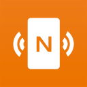

# Lnk3d Coin: The Ultimate Fusion of Physical and Digital Interaction
Welcome to the world of Lnk3d Coin – a groundbreaking innovation that merges 3D printing and NFC technology, offering a seamless bridge between the physical and digital realms. In an era where technology continually redefines boundaries, Lnk3d Coin presents a unique and captivating means of interacting with the digital world.

- [Lnk3d Coin: The Ultimate Fusion of Physical and Digital Interaction](#lnk3d-coin-the-ultimate-fusion-of-physical-and-digital-interaction)
  - [The Linked Coin: A Window to a New Reality](#the-linked-coin-a-window-to-a-new-reality)
    - [Endless Use Cases](#endless-use-cases)
    - [Programming  Your Coin](#programming--your-coin)
    - [3D Print Your Own](#3d-print-your-own)
    - [Printed Examples](#printed-examples)

## The Linked Coin: A Window to a New Reality
Lnk3d Coin is no ordinary coin; it's a tangible token equipped with an embedded NFC tag, granting it extraordinary capabilities. With the power of NFC technology at your disposal, you can effortlessly connect the physical and digital worlds in ways previously unimagined.

### Endless Use Cases

Lnk3d Coin is a versatile tool with endless applications:

- **Virtual Contact Cards:** Share your contact details in a modern and convenient way, making networking a breeze.
  - Public/Free vCard hosting: [vCard.link](https://vcard.link/card/)
- **GitHub Repository Links:** Direct others to your open-source projects, enabling seamless collaboration.
- **Any Website Link:** Whether it's your personal blog, a favorite online store, or an informative article, Lnk3d Coin can effortlessly connect users to any online destination.
- **CryptoCurrency Wallet:** Link your Lnk3d Coin to your cryptocurrency wallet address. This makes it easy for others to send you digital currency securely, and it's a convenient way to share your wallet address during transactions or when receiving payments.
- **Event Promotion:** If you're hosting an event or conference, program your Lnk3d Coin with event details, including date, time, location, and a link to the event website. Distribute these coins to attendees, allowing them to access event information with a simple tap.
- **Educational Resources:** For educators, link Lnk3d Coins to online educational resources such as lecture notes, tutorials, or video lectures. Students can tap the coin to instantly access these materials, enhancing their learning experience.
- **Art and Portfolio Showcase:** Artists and creatives can use Lnk3d Coins to showcase their portfolios. Each coin can be programmed to link to a different piece of artwork, a website with their portfolio, or an online gallery, allowing potential clients or art enthusiasts to explore their work easily.
- **Museum and Exhibition Guides:** Museums and art galleries can use Lnk3d Coins as interactive guides for visitors. Each coin can be programmed to provide information about specific exhibits, artists, or historical artifacts, enhancing the visitor experience.
- **Digital Souvenirs:** Tourist destinations can offer Lnk3d Coins as digital souvenirs. These coins can be programmed to provide information about the location, historical facts, or even discounts at local businesses when tapped by tourists.
- **Interactive Marketing:** Businesses can use Lnk3d Coins for interactive marketing campaigns. Coins can be programmed to reveal discounts, promotions, or exclusive content when tapped, incentivizing customer engagement.
- **Access Control:** Use Lnk3d Coins for access control to secure areas or events. Program each coin with an access code or link to grant entry to authorized individuals, providing a convenient and contactless entry method.

### Programming  Your Coin

Harnessing the power of Lnk3d Coin is as easy as downloading an NFC writer app to your mobile device. It is accessible for both Android and Apple users:

1. Download an NFC Writer
   - Android - [NFC Tools](https://play.google.com/store/apps/details?id=com.wakdev.wdnfc&hl=en_US&gl=US)
   - Apple - [NFC Tools](https://apps.apple.com/us/app/nfc-tools/id1252962749)

<strong>NFC Tools Logo</strong>
 

Once you have your NFC writer app, you can program your Lnk3d Coin to perform a multitude of functions, from creating virtual contact cards to linking to GitHub repositories, or any website you desire.

1. Program Example (URL)
   - Add a record
    
    
    
   - Write the record
    
    

### 3D Print Your Own

If you're intrigued by the potential of Lnk3d Coin and eager to embark on your creative journey, our repository provides comprehensive instructions on 3D printing your personalized Lnk3d Coins. Get ready to unlock your imagination and redefine the way you connect with the digital landscape.

Join us on this exciting adventure as we push the boundaries of what's possible when physical and digital interaction converge. With Lnk3d Coin, the future is now, and the opportunities are limitless.

### Printed Examples
- Groff Coin
