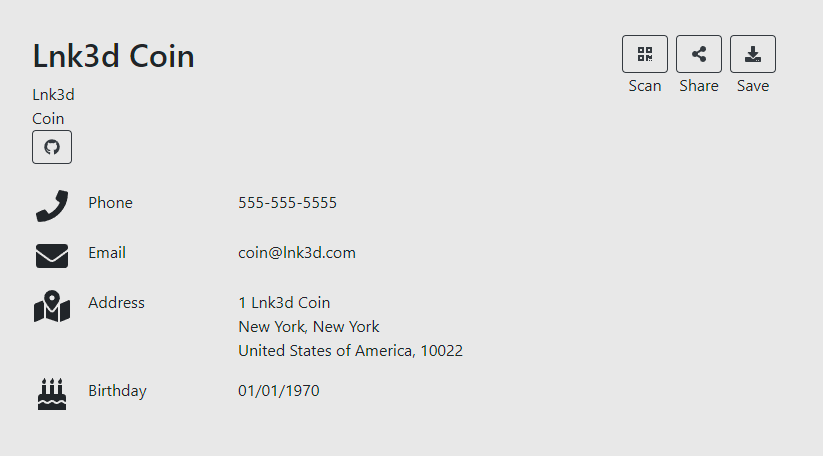

# Program Lnk3d Coin as a Virtual Contact Card
- [Program Lnk3d Coin as a Virtual Contact Card](#program-lnk3d-coin-as-a-virtual-contact-card)
  - [Step1: vCard Setup](#step1-vcard-setup)
  - [Step 2: NFC Tag Programming](#step-2-nfc-tag-programming)
    - [iPhone:](#iphone)
    - [Android](#android)
  - [Step 3: Use Lnk3dCoin](#step-3-use-lnk3dcoin)

## Step1: vCard Setup

This portion of the setup can be done from a computer or mobile device. You will need access to a browser and ability to create/store a password for later use.

- Go to [https://vCard.link](https://vCard.link)
- Name your card "Company-FirstName" 
  - This is arbitrary, I have two. One for work, one for home. 
- Enter your Work or Personal or Work email address and create a password.
- Fill out your information that you’d like to have people see.
- Create Card

Once done, you will have a link as such: [https://vcard.link/card/DG5m](https://vcard.link/card/DG5m)  
When navigating to that link, you will see a similar page:

## Step 2: NFC Tag Programming

The NFC tag in the Lnk3dCoin is now ready to be programmed with the link from the above step.

Grab link from previous step and append ".vcf" to the end as such: [https://vcard.link/card/DG5m.vcf](https://vcard.link/card/DG5m.vcf)  
This is the direct download link to the vcard file instead of just a link to the file

### iPhone:

- Download & Install [NFC Tools](https://apps.apple.com/us/app/nfc-tools/id1252962749)
- Open the app once it installs
- Select "Write"
- Add a URL Record
- Paste the [https://vcard.link/card/DG5m.vcf](https://vcard.link/card/DG5m.vcf) link and hit OK (Make sure to take the link created in step one and add on .vcf to the end of the URL)
- Select "Write" again and hover/slide your phone over the Lnk3dCoin where your NFC Reader is.

### Android

- Download & Install [NFC Tools](https://play.google.com/store/apps/details?id=com.wakdev.wdnfc&hl=en_US&gl=US)
- Open the app once it installs
- Select "Write"
- Add a URL Record
- Paste the [https://vcard.link/card/DG5m.vcf](https://vcard.link/card/DG5m.vcf) link and hit OK (Make sure to take the link created in step one and add on .vcf to the end of the URL)
- Select "Write" again and hover/slide your phone over the Lnk3dCoin where your NFC Reader is.

## Step 3: Use Lnk3dCoin

Using an NFC supported devices, scan your Lnk3dCoin and test to make sure the link works.
